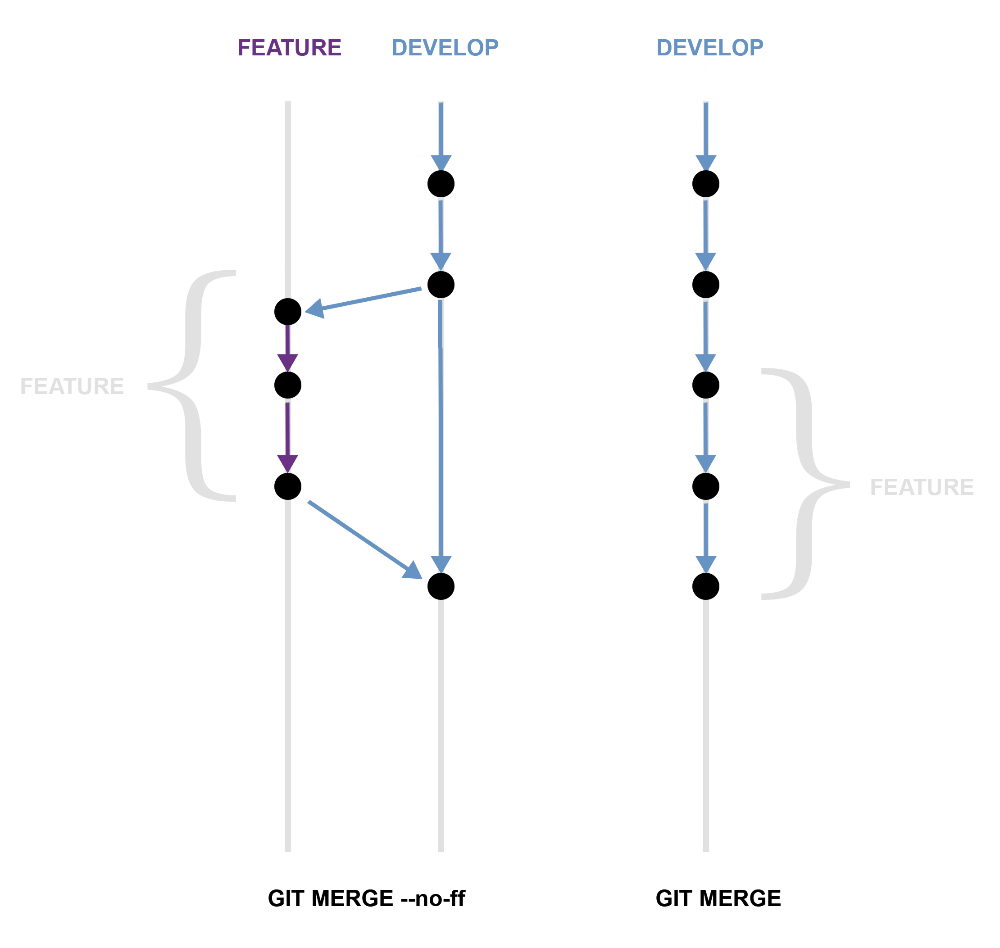

# Feature

- Criação a partir de: `dev`
- Deve ser mesclada em: `dev`
- Nomenclatura: `feature/*`

A branch `feature` é utilizada para desenvolver novas funcionalidades para o projeto. Dependendo do tempo de vida dessa branch, ela precisará ser atualizada e não ficar muito distante da sua branch de origem. Digamos que fique trabalhando por 2 semanas nessa branch, dependendo do ritmo da equipe e das tarefas, esse tempo pode provocar uma distinção muito grande e acarretar muitos conflitos quando devolver essa branch para `dev`. Nesse caso, será necessário que faça um `rebase`, nessa branch `feature`, antes de enviar o _Pull Request_ .

Normalmente uma branch `feature` existe apenas no repositório do desenvolvedor, não em origin. Mas como acredito que não podemos dar vez para o azar, é melhor essa descisão ficar por conta do alinhamento da equipe.

## Criando uma branch

Para começar em um novo recurso, deverá ser criado uma nova branch a partir de `dev`. 

```
$ git checkout -b feature/20160104_resource-name dev
```

## Finalizando uma branch

A branch atingiu o seu objetivo e o recurso nela desenvolvido, já está pronto para ser mesclado com a branch de `dev`. 
```
$ git checkout dev
$ git merge --no-ff feature/20160104_resource-name
$ git branch -d feature/20160104_resource-name
$ git push origin dev
```

A flag `--no-ff` faz a impressão em série para criar sempre um novo objeto commit, mesmo se a fusão poderia ser realizada com um `fast-forward`. Isso evita a perda de informações sobre a existência histórica de uma branch `feature` e reune todos os commits que juntos adicionaram o recurso. Exemplo:



Sem a `flag` é impossível ver a história dos objetos, já que teria que ler manualmente todas as mensagens de log para identificar os `commits`. Reverter uma `feature` totalmente, é uma dor de cabeça na última situação, enquanto ele é feito facilmente se o `--no-ff` foi usado.

Sim, ele vai criar um vazio no commit de objetos, mas o ganho é muito maior do que o custo. 